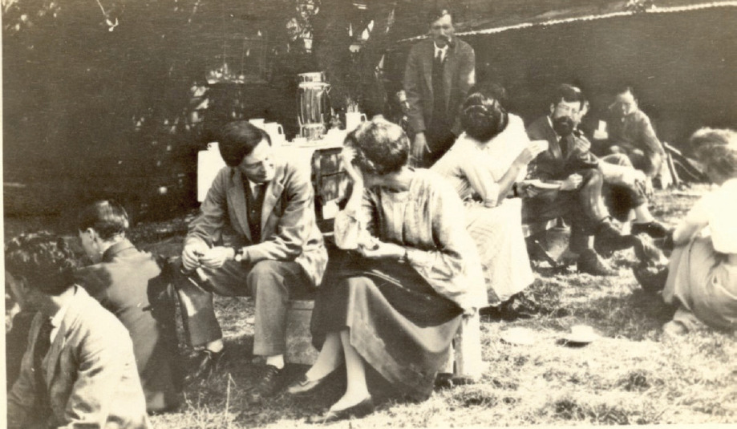

 
Agricultural experiments played a very important role in the development of modern statistis since Ronald Fisher's works at the Rothamsted Experimental Station (UK). See the article by [Robert Langkjær-Bain (2018)](https://rss.onlinelibrary.wiley.com/doi/full/10.1111/j.1740-9713.2018.01144.x) for further historical details.
