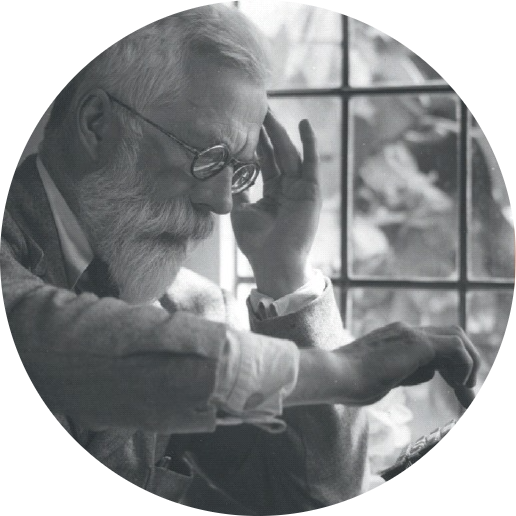
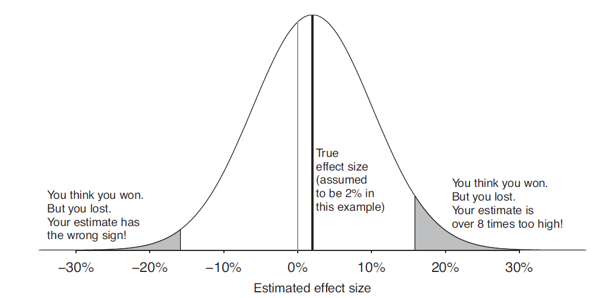
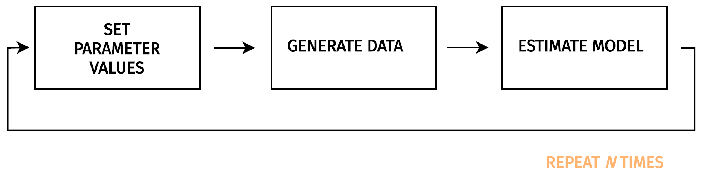
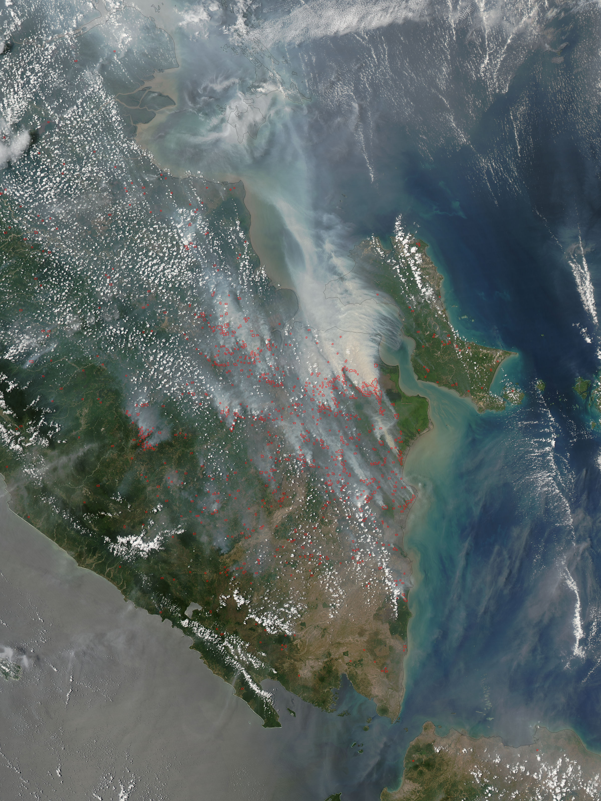
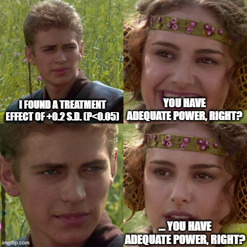

<style>
.center2 {
  margin: 0;
  position: absolute;
  top: 50%;
  left: 50%;
  -ms-transform: translate(-50%, -50%);
  transform: translate(-50%, -50%);
}
</style>

```{r xaringan-themer, include=FALSE, warning=FALSE}
# load package to customize xaringan slides
library(xaringanthemer)

style_mono_accent(
  # title page
  title_slide_background_color = "#348aa7",
  title_slide_text_color  = "#FFFFFF",
  title_slide_background_image = ,
  title_slide_background_size = "30%",
  title_slide_background_position = "90% 75%",
  # document
  base_color = "#007BA7",
  header_color = "#348aa7",
  text_bold_color = "#348aa7",
  text_font_size = "x-large",
  link_color = "#ffbf69",
  inverse_background_color = "#348aa7",
  # fonts
  header_font_google = google_font("Roboto Condensed", "300", "400"),
  text_font_google = google_font("Roboto Condensed"),
  code_font_google = google_font("Fira Mono")
)
```

```{r setup, include=FALSE, results='hide', warning=FALSE}
library(knitr)
opts_chunk$set(cache = FALSE,
               echo = TRUE,
               message = FALSE,
               warning = FALSE,
               dev = "CairoPNG",
               dpi = 300)

# load packages
library(here) # for file paths management
library(knitr) # for generating dynamic report
library(tidyverse) # for data manipulation and visualization
library(AER) # for running iv model
library(broom) # for cleaning statistical model output
library(retrodesign) # for retrospective power analysis

# load ggplot custom theme
source(here::here("functions", "script_theme_tufte.R"))

# define two main colors
my_orange <- "#ffbf69"
my_blue <- "#348aa7"
```

---
class: inverse, center, middle
background-color: #272822;

# Is a Replicability Crisis on the Horizon for Environmental and Resource Economics?

---
# Paul J. Ferraro and Pallavi Shukla (2020)

```{r, echo = FALSE, fig.align = 'center', fig.width = 7, fig.height = 3, out.width = "150%"}
# load t-statistics data
haven::read_dta(here::here("data", "data_replication_ferraro_shukla.dta")) %>%
  group_by(studyid) %>%
  mutate(obs_by_article = n()) %>%
  group_by(studyid, table_no) %>%
  mutate(obs_by_table = n()) %>%
  group_by(studyid) %>%
  mutate(tab_by_article = length(unique(table_no))) %>%
  ungroup() %>%
  mutate(
    weight_article = 1 / obs_by_article,
    weight_table = 1 / obs_by_table * 1 / tab_by_article,
    weight_table_round = round(weight_table * 10 ^ 8)
  ) %>%
  filter(abs_tstat_sm <= 10 & main_result == 1) %>%
  ggplot(. , aes(x = abs_tstat_sm, weights = weight_table_round)) +
  geom_density(colour = my_blue, size = 1.2) +
  geom_vline(xintercept = 1.96, colour = my_orange) +
  scale_x_continuous(breaks = scales::pretty_breaks(n = 15)) +
  xlab("Absolute t-Statistics") + ylab("") +
  ggtitle("Distribution of t-Statistics in 307 Environmental Economic Papers", subtitle = "~ 19k estimates") +
  theme_tufte() +
  theme(axis.text.y = element_blank(),
        axis.ticks.y = element_blank())
```


---
# The Null Hypothesis Significance Testing Framework (NHST)


.pull-left[
```{r, echo=FALSE, fig.align = 'center', out.width = '68%'}
knitr::include_graphics("https://rss.onlinelibrary.wiley.com/cms/asset/9ec91b71-2007-4609-b6a0-f88abac4e39b/sign619-gra-0001-m.jpg") 
```
]
.pull-right[
<br>
* *Every experiment may be said to exist only to give the facts a chance of disproving the null hypothesis.*

* Actually not a very interesting hypothesis

* Very bad consequences for research

* People are obsessed with p-values

* Dichotomize evidence according to them

* Leads to publication bias
]

---
# NHST + Publication Bias = `r emo::ji("scared")`


.pull-left[

**Paul J. Ferraro and Pallavi Shukla (2020):**

* Median Power is 33%

* 56% of reported estimates are 2 times too large

* 35% are exaggerated by a factor of 4 or more

]
.pull-right[
```{r, echo=FALSE, fig.align = 'center' , out.width = '100%'}
knitr::include_graphics("https://media.giphy.com/media/RX3vhj311HKLe/giphy.gif") 
```
]
<br>
<br>
<p style="text-align: center;color:#ffbf69;"><b><big>WHEN STUDIES HAVE A LOW STATISTICAL POWER, THEY MUST FIND LARGE EFFECT SIZES TO PASS THE SIGNIFICANCE FILTER</big></b></p>

---




---
background-image: url(https://camo.githubusercontent.com/b1643d972b1c1dc918b6b17e389349208d68ab37/68747470733a2f2f692e70696e696d672e636f6d2f6f726967696e616c732f31362f31322f38372f31363132383765323135643038333966373566333264363936323563643130322e676966)
background-position: center
background-size: contain

---
# Today's Battle Plan

.pull-left[
<br>
<br>
1. A **toy example** for understanding the issues raised by low power

2. **Prospective power analysis** to design better powered studies

3. **Retrospective power analysis** to evaluate if a study suffers from these issues
]
.pull-right[
```{r, echo=FALSE, fig.align = 'center' , out.width = '100%'}
knitr::include_graphics("https://m.media-amazon.com/images/M/MV5BNzg2NTA2MTU4OF5BMl5BanBnXkFtZTcwMDkxNTcyOQ@@._V1_.jpg") 
```
]


---
# Software Requirements

.pull-left[
**Installing R & RStudio:**

- R : https://cran.r-project.org

- RStudio: https://rstudio.com/

**Packages:**

- `here`: for file paths management
- `tidyverse`: for data wrangling & visualization
- `broom`: for cleaning regression outputs
- `AER`: for running IV models
- `retrodesign`: for retro power analysis
]
.pull-right[
<br>
<br>
```{r, echo=FALSE, out.width = '100%'}
knitr::include_graphics("https://media.giphy.com/media/aNqEFrYVnsS52/giphy.gif") 
```
]


---
# Coding

<br>
<br>
* GitHub link: https://github.com/lzabrocki/workshop_power

* **Download the folder!**

* Folder **scripts_tutorial** contains all the R scripts

* `slides_power.html` are the slides of the workshop

* `tutorial_power.html` explains with texts all the stuff covered today


---
class: inverse, center, middle
background-color: #272822;

# Why P-Values Are Misleading in Low Power Studies


---
# An Agricultural Experiment

.pull-left[
* Draw inspiration from a recent study by [Jacob R. Pecenka et al. (2021)](https://www.pnas.org/doi/10.1073/pnas.2108429118#abstract)

* Compared to conventional practices (CM), an integrated pest management system (IPM) can **reduce insecticide use by 95%** and even **increase the yields of food crops** since wild bees are conserved. 

* $N$ fields are randomly allocated either to IPM or CM. 

* For each field, the yield of watermelons in $kg/m^2$ is measured. 
]
.pull-right[
<br>
<br>
```{r, echo=FALSE, out.width = '100%'}
knitr::include_graphics("https://rss.onlinelibrary.wiley.com/cms/asset/9d3c14b5-058c-4ab4-b0b6-dc35e28aa14a/sign1144-gra-0004-m.jpg") 
```
]

---
# Simulating the Data

<br>
If we denote $i$ the index of a field, the DGP can be summarized by:

\begin{equation*}
Y_{i}(W_i=1) = Y_{i}(W_i=0) + \tau_{i}
\end{equation*}

* $Y_{i}(0)\sim N(14, 5)$ is the potential watermelon yields when the field is not treated: $(W_i=0)$. 

* For each field $i$, the potential watermelon yields when the field is treated $(W_i=1)$ is created by drawing a treatment unit-causal effect from $\tau_{i} \sim N(1, 3)$. 

* This DGP is the classic additive treatment effect model under Normality.

---
# In R

Open `script_introductory_example.R`

If they are installed, load the following packages:

```{r}
library(here) # for file paths management
library(tidyverse) # for data manipulation and visualization
```

---
# Function to Simulate the Science Table

`function_science_table()` creates the data:

```{r}
# function to create the science table
function_science_table <- function(sample_size) {
  # define field index and y(0)
  tibble(field = c(1:sample_size),
         y_0 = rnorm(sample_size, 14, 5)) %>%
    # define y(1) by adding treatment effect size
    mutate(y_1 = y_0 + rnorm(sample_size, 1, 3)) %>%
    # round values of potential outcomes
    mutate_at(vars(y_0, y_1), ~ round(., 1))
}
```

---
# Running the Function

We run the function for a sample size of 50 fields:

```{r}
# set seed
set.seed(42)

# create a science table for 100 fields
data_science <- function_science_table(50)

# print table
data_science %>% slice(1:5)
```

---
```{r, echo = FALSE, fig.width = 4, fig.height = 4, fig.align = "center", out.width = "60%"}
# plot the distributions of potential outcomes
data_science %>%
  rename("Y(0)" = y_0, "Y(1)" = y_1) %>%
  pivot_longer(cols = -c(field),
               names_to = "Potential Outcomes",
               values_to = "values") %>%
  group_by(`Potential Outcomes`) %>%
  mutate(mean_outcomes = mean(values)) %>%
  ggplot(. , aes(x = `Potential Outcomes`, y = values, colour = `Potential Outcomes`)) +
  geom_boxplot()+
  geom_jitter(alpha = 0.8) +
  scale_y_continuous(breaks = scales::pretty_breaks(n = 10)) +
  scale_colour_manual(values = c(my_blue, my_orange)) +
  xlab("") + ylab(expression(paste("Yields of Watermelons (", "kg/", m^2, ")"))) +
  theme_tufte() +
  labs(colour = "Potential Outcomes:")
```

---
# Computing the True ATE

As we observe both potential outcomes for each field, we can compute the true value of the finite sample average treatment effect $\tau_{fs}$ as:

\begin{equation*}
\tau_{fs} = \frac{1}{N} \sum_{i=1}^{N}\left(Y_i(1) - Y_i(0) \right)
\end{equation*}

```{r}
# compute value of the ate
ate <- data_science %>%
  mutate(tau = y_1 - y_0) %>%
  summarise(mean(tau) %>% round(., 1)) %>%
  pull()

# display the value
ate
```

---
# Running One Iteration of the Experiment

```{r}
# load one iteration of the experiment
data_science_one_iteration <- readRDS(here::here("data", 
                                                 "data_science_one_iteration.rds"))
```

Once the treatment has been allocated, we express the observed watermelon yields $Y^{obs}$ such that:

\begin{equation*}
Y^{obs}_{i} = W_{i}\times Y_{i}(1) + (1-W_{i})\times Y_{i}(0)
\end{equation*}

```{r}
# express observed yields
data_science_one_iteration <- data_science_one_iteration %>%
  mutate(y_obs = w * y_1 + (1 - w) * y_0)
```

---
# Estimating the ATE & Computing 95% CI
To estimate the average causal effect, we compute the difference in the average yields between treated and control units $\hat{\tau}$:

\begin{equation*}
\hat{\tau} = \frac{1}{N_{t}} \sum_{i|W_{i}=1} Y_i^{obs} - \frac{1}{N_{c}} \sum_{i|W_{i}=0} Y_i^{obs}
\end{equation*}

where $N_{t}$ and $N_{c}$ are respectively the sample size of treated and control groups. To compute the variance of the estimator $\hat{\tau}$, we use Neyman's estimator:


\begin{equation*}
\hat{\mathbb{V}}(\hat{\tau}) = \frac{\frac{1}{N_{c}-1} \sum_{i|W_{i}=0} \left(Y_i^{obs} - \bar{Y_{c}} \right)^2}{N_{c}} + \frac{\frac{1}{N_{t}-1} \sum_{i|W_{i}=1} \left(Y_i^{obs} - \bar{Y_{t}} \right)^2}{N_{t}}
\end{equation*}

And compute a 95% confidence intervals with a normal approximation:

\begin{equation*}
\text{CI}_{0.95}(\tau_{fs}) = (\hat{\tau}-1.96\sqrt{\hat{\mathbb{V}}}, \hat{\tau}+1.96\sqrt{\hat{\mathbb{V}}})
\end{equation*}


---
# In R
We can compute the point estimate for the treatment effect and the 95% confidence interval with the following code:

```{r}
# compute estimate for ate
estimate_ate <- data_science_one_iteration %>%
  group_by(w) %>%
  summarise(group_mean = mean(y_obs)) %>%
  summarise(group_mean[2] - group_mean[1]) %>%
  pull()
```

---
# In R

```{r}
# compute associated standard error
standard_error <- data_science_one_iteration %>%
  group_by(w) %>%
  mutate(
    n_obs = n(),
    average_y_obs = mean(y_obs),
    squared_difference = (y_obs - average_y_obs) ^
      2,
    variance_group = sum(squared_difference) / (n_obs - 1)
  ) %>%
  summarise(variance_component = mean(variance_group / n_obs)) %>%
  summarise(variance = sum(variance_component),
            standard_error = sqrt(variance)) %>%
  pull(standard_error)
```

---
# In R

```{r}
# return ate estimate and 95% confidence interval
results_one_iteration <- tibble(
  estimate_ate = estimate_ate,
  lower_95_ci = estimate_ate - 1.96 * standard_error,
  upper_95_ci = estimate_ate + 1.96 * standard_error
) %>%
  mutate_all( ~ round(., 1))

# print results
results_one_iteration
``` 

---
# Replicating Many Times the Experiment

To save time, I have already stored the results:

```{r}
# load 1000 iterations of the experiment
data_results_1000_experiments <- readRDS(here::here("data",
                                                    "data_results_1000_experiments.rds"))

# add iteration index
data_results_1000_experiments <- data_results_1000_experiments %>%
  mutate(iteration = 1:1000) %>%
  mutate(significant = ifelse(significant == 1, "True", "False"))
```

---

```{r, echo = FALSE, fig.width=7, fig.height=4, fig.align = "center", out.width="90%"}
# make the graph
ggplot(
    data_results_1000_experiments,
    aes(x = iteration, y = estimate_ate, color = significant)
  ) +
  geom_hline(yintercept = mean(data_results_1000_experiments$estimate_ate),
             size = 0.25,
             colour = "black") +
  geom_point(shape = 16,
             size = 1,
             alpha = 0.8) +
  scale_color_manual(name = "Statistically Significant at the 5% Level", values = c(my_blue, my_orange)) +
  scale_x_continuous(breaks = scales::pretty_breaks(n = 10)) +
  scale_y_continuous(breaks = scales::pretty_breaks(n = 14)) +
  xlab("Iteration") + ylab("Estimate") +
  theme_tufte() +
  guides(colour = guide_legend(override.aes = list(alpha = 1, size = 3)))
```

---
<br>
<br>
<br>

```{r, echo = FALSE, fig.width = 10, fig.height = 4, fig.align = "center", out.width = "120%"}
# create the graph
data_results_1000_experiments %>%
  slice(1:100) %>%
  ggplot(
    .,
    aes(
      x = iteration,
      colour = significant,
      y = estimate_ate,
      ymin = lower_95_ci,
      ymax = upper_95_ci
    )
  ) +
  geom_hline(yintercept = 0, colour = "black") +
  geom_hline(yintercept = ate, colour = "grey") +
  geom_pointrange(lwd = 0.3) +
  scale_colour_manual(values = c(my_blue, my_orange)) +
  scale_x_continuous(breaks = scales::pretty_breaks(n = 10)) +
  scale_y_continuous(breaks = scales::pretty_breaks(n = 15)) +
  xlab("Iteration") + ylab("Estimate") +
  theme_tufte() +
  theme(legend.position = "none")
``` 


---
# Defining & Computing Statistical Power

First, the statistical power for rejecting the null hypothesis $H_{0} : \tau_{fs} = 0$ is given by:

\begin{equation*}
\Phi(−1.96 − \frac{\tau_{fs}}{s}) + 1 − \Phi(1.96 − \frac{\tau_{fs}}{s})
\end{equation*}

with $s$ the standard error of our estimate $\hat{\tau}$ and $\Phi$ the cumulative function of the standard normal distribution.

```{r}
# retrieve standard error of the first experiment iteration
s <- (results_one_iteration$upper_95_ci - results_one_iteration$estimate_ate) / 1.96

# compute power using its definition
(pnorm(-1.96 - 1.3 / s) + 1 - pnorm(1.96 - 1.3 / s)) * 100
``` 

---
# Computing Power with Simulation Results
```{r}
# compute power using simulation results
power_simulation <- data_results_1000_experiments %>%
  summarise(statistical_power = round(sum(significant == "True") / n() * 100, 0))

# print result
power_simulation
```

---
# Defining & Computing Type M Error

The average Type M error is defined as:
\begin{equation*}
\mathbb{E}\left(\frac{|\hat{\tau}|}{|\tau_{fs}|} | \tau_{fs}, s, |\hat{\tau}|/s>1.96 \right)
\end{equation*}

```{r}
# compute average type m error
type_m <- data_results_1000_experiments %>%
  filter(significant == "True") %>%
  summarise(exageration_factor = mean(abs(estimate_ate) / ate) %>% round(., 1))

# display result
type_m
```

---
# Defining & Computing Type S Error

The probability to make a type S error is:

\begin{equation*}
\frac{\Phi(-1.96-\frac{\tau_{fs}}{s})}{1-\Phi(1.96-\frac{\tau_{fs}}{s}) + \Phi(-1.96 - \frac{\tau_{fs}}{s})}
\end{equation*}

```{r}
# compute probability to make a type s error
type_s <- data_results_1000_experiments %>%
  filter(significant == "True") %>%
  summarise(probability_type_s_error = round(sum(estimate_ate < 0) / n() * 100, 1))

# display result
type_s
```

---
# How Type M and S Errors Evolve with Power

To save time, I have already stored the results:

```{r}
# load simulations of the experiment for increasing sample sizes
data_power_sample_size_sim <- readRDS(here::here("data", "data_power_sample_size_sim.rds"))
```

For each sample size, we compute the power, type M and S errors:

```{r}
# compute power, type m and s errors
summary_power_sample_size_sim <- data_power_sample_size_sim %>%
  group_by(sample_size) %>%
  summarise(
    power = mean(significant == 1, na.rm = TRUE) * 100,
    type_m = mean(ifelse(
      significant == 1, abs(estimate_ate / ate), NA
    ), na.rm = TRUE),
    type_s = sum(ifelse(
      significant == 1, sign(estimate_ate) != sign(ate), NA
    ), na.rm = TRUE) / n() * 100
  )
```

---
<br>
<br>
<br>
```{r, echo = FALSE, fig.width=8, fig.height=3, fig.align = "center", out.width = "100%"}
# make the graph
summary_power_sample_size_sim %>%
  pivot_longer(cols = -c(sample_size, type_s),
               names_to = "metric",
               values_to = "value") %>%
  mutate(metric = ifelse(metric == "power", "Power (%)", "Type M Error")) %>%
  ggplot(.,
         aes(x = sample_size, y = value)) +
  geom_point(colour = my_blue) +
  scale_x_continuous(breaks = scales::pretty_breaks(n = 10)) +
  scale_y_continuous(breaks = scales::pretty_breaks(n = 14)) +
  facet_wrap( ~ metric, nrow = 1, scales = "free_y") +
  xlab("Sample Size") + ylab("") +
  theme_tufte()
```

---
class: inverse, center, middle
background-color: #272822;

# Prospective Power Analysis

---
# Standard Approach

Statistical power is defined as:

\begin{equation*}
\beta = \Phi\left(\frac{|\mu_{t}-\mu_{c}|\sqrt{N}}{2\sigma} - \Phi^{-1}(1-\frac{\alpha}{2})\right)
\end{equation*}

* $Phi$ is the cumulative distribution function of the normal distribution.

* $\mu_t$ and $mu_c$ are the average outcomes of the treatment and control groups.

* $\sigma$ is the standard deviation of the outcome. Here, we assume that it is the same for both groups.

* $\alpha$ is the significance level.

* $N$ is the number of units.

---
# Simulation-Based Approach: Health Effects of Forest Fires

<br>
<br>
```{r, echo=FALSE, out.width = '100%'}

```

---
# In R

Open `script_prospective_power_analysis.R`

If they are installed, load the following packages:

```{r}
library(here) # for file paths management
library(tidyverse) # for data manipulation and visualization
library(AER) # for running iv model
library(broom) # for cleaning statistical model output
```

The coding workflow of this section was designed by [Vincent Bagilet](https://vincentbagilet.github.io/causal_inflation/) and relies heavily on the `purrr` package.

---
# Defining the DGP
.pull-left[

**Model for emergency admissions:**

\begin{equation*}
Emergency_{t} = \alpha + \beta Pollution_{t} + \delta u_{t} + e^{(E)}_{t}
\end{equation*}

**Model for air pollution:**

\begin{equation*}
Pollution_{t} = \gamma + \lambda Fire_{t} + \eta u_{t} + e^{(P)}_{t}
\end{equation*}

* $t$ the day index
* $Fire \sim \text{Gamma}(k, \theta)$.
* $u \sim \mathcal{N}(0, \sigma_{u}^{2})$ the unobserved variable.
* $e^{(S)} \sim \mathcal{N}(0, \sigma_{e_S}^{2})$.
* $e^{(T)} \sim \mathcal{N}(0, \sigma_{e_T}^{2})$.
]
.pull-right[
```{r, echo=FALSE, fig.align = 'center' , out.width = '65%'}
 
```
]


---
# Function to Generate the Data
```{r}
# generate IV data
generate_data_IV <- function(N,
                             param_fire,
                             sigma_u,
                             sigma_ee,
                             sigma_ep,
                             alpha,
                             gamma,
                             treatment_effect,
                             iv_strength,
                             ovb_intensity) {
  # first create day index
  data <- tibble(id = 1:N) %>%
    mutate(
      # create fire radiative power from a gamma distribution
      fire = rgamma(N, shape = param_fire[1], scale = param_fire[2])*50000,
      # create the unobserved variable
      u = rnorm(nrow(.), 0, sigma_u),
      # random noise for the emergency model
      e_e = rnorm(nrow(.), 0, sigma_ee),
      # random noise for the air pollution model
      e_p = rnorm(nrow(.), 0, sigma_ep),
      # create air pollution variable
      pollution = gamma + iv_strength * fire + ovb_intensity * u + e_p,
      # create emergency admission variable
      emergency = alpha + treatment_effect * pollution + ovb_intensity * u + e_e
    )
  
  return(data)
}
```

---
# Setting the Values

```{r simple_param_IV}
baseline_param_IV <- tibble(
  N = 3650,
  param_fire = list(c(1, 2)),
  sigma_u = 1,
  sigma_ee = 100,
  sigma_ep = 5,
  alpha = 400,
  gamma = 30,
  treatment_effect = 1,
  iv_strength = 10/100000, 
  ovb_intensity = 0.4
)
```


---
# Simulating One Dataset

```{r}
# set seed
set.seed(42)

# simulate one dataset
data_fire <- baseline_param_IV %>%
  pmap_dfr(generate_data_IV)
```

---
# Relationship between Air Pollution & Forest Fire

```{r}
# check effect of forest fires on air pollution
data_fire %>%
  mutate_at(vars(fire, pollution), ~ scale(.)) %>%
  lm(pollution ~ fire + u, data = .) %>%
  broom::tidy(., conf.int = TRUE) %>%
  filter(term == "fire")
```

A one standard deviation increase in the fire radiative power increases the concentration of $\text{PM}_{10}$ by about **0.46** standard deviation.

---
# Relationship between Air Pollution & Emergency

```{r}
# check effect of instrumented air pollution on emergency admission
data_fire %>%
  mutate_at(vars(fire, pollution), ~ scale(.)) %>%
  AER::ivreg(data = .,
                       formula = log(emergency) ~ pollution | fire) %>%
  broom::tidy(., conf.int = TRUE) %>%
  filter(term == "pollution")
```

A one standard deviation in instrumented air pollution increases emergency admission by **6%**.

---
# Function for Estimating IV Model

We create below the function `estimate_IV()` to estimate the IV model in our simulations:

```{r}
# estimate IV model
estimate_IV <- function(data) {
  reg_IV <- AER::ivreg(data = data,
                       formula = emergency ~ pollution | fire)
  
  fstat_IV <- summary(reg_IV,
                      diagnostics = TRUE)$diagnostics["Weak instruments", "statistic"]
  
  reg_IV <- reg_IV %>%
    broom::tidy(., conf.int = TRUE) %>%
    mutate(fstat = fstat_IV) %>%
    filter(term == "pollution") %>%
    rename(p_value = p.value, se = std.error, conf_low = conf.low, conf_high = conf.high) %>%
    select(estimate, p_value, se, conf_low, conf_high, fstat) %>%
    
    return(reg)
}
```

---
# Function to Run the Simulations

We combine the functions `generate_data_IV` and `estimate_IV` into a single function `compute_sim_IV` to run our simulations:

```{r}
# define compute_sim_IV
compute_sim_IV <- function(N,
                           param_fire,
                           sigma_u,
                           sigma_ee,
                           sigma_ep,
                           alpha,
                           gamma,
                           treatment_effect,
                           iv_strength,
                           ovb_intensity) {
  generate_data_IV(
    N = N,
    param_fire = param_fire,
    sigma_u = sigma_u,
    sigma_ee = sigma_ee,
    sigma_ep = sigma_ep,
    alpha = alpha,
    gamma = gamma,
    treatment_effect = treatment_effect,
    iv_strength = iv_strength,
    ovb_intensity = ovb_intensity
  ) %>%
    estimate_IV() %>%
    mutate(
      iv_strength = iv_strength,
      ovb_intensity = ovb_intensity,
      true_effect = treatment_effect
    )
} 
```

---
# Varying Parameters
```{r}
# set vector of iv strengths
vect_iv_strength <- c(1, 2, 3, 4, 5, 10) / 100000

# number of iterations
n_iter <- 500

# create parameters of the simulations
param_IV <- baseline_param_IV %>%
  select(-iv_strength) %>%
  crossing(vect_iv_strength) %>%
  rename(iv_strength = vect_iv_strength) %>%
  crossing(rep_id = 1:n_iter) %>%
  select(-rep_id)
```

---
# Results

To save time, we have already the simulations and we load the results:

```{r}
# load simulations data
sim_IV <- readRDS(here::here("data", "data_sim_power_fire.rds"))
```

We define the `summarise_simulations()` to compute power, type M error, the first-stage F-statistics but also the mean width of 95% confidence intervals:

```{r}
# summary relevant metrics
summarise_simulations <- function(data) {
  data %>%
    mutate(significant = (p_value <= 0.05)) %>% 
    group_by(ovb_intensity, iv_strength) %>%
    summarise(
      power = mean(significant, na.rm = TRUE)*100, 
      type_m = mean(ifelse(significant, abs(estimate/true_effect), NA), na.rm = TRUE),
      mean_fstat = mean(fstat, na.rm = TRUE),
      mean_width_ci = mean(abs(conf_high - conf_low)),
      .groups	= "drop"
    ) %>% 
    ungroup()
} 
```

---
# Computing Relevant Metrics

We run the function:

```{r}
# run summarise_simulations
summary_sim_IV <- summarise_simulations(sim_IV)
```

And display below the results:

```{r, echo = FALSE}
# display simulation results
summary_sim_IV %>%
  select(-ovb_intensity) %>%
  mutate_at(vars(power, type_m, mean_width_ci), ~ round(., 1)) %>%
  mutate(mean_fstat = round(mean_fstat, 0)) %>%
  rename(
    "Strength of the IV" = iv_strength,
    "Power (%)" = power,
    "Type M Errror" = type_m,
    "F-Statistic" = mean_fstat,
    "Width of 95% CI" = mean_width_ci
  )
```


---
class: inverse, center, middle
background-color: #272822;

# Retrospective Power Analysis

---
# Intuition

* Imagine that we have analyzed observational data with a particular causal inference method. 

* The true causal effect is $\beta$ and we found an estimate $\hat{\beta}$ with a standard error $s$. 

* The estimate is statistically significant at the 5% level.

* Computing the statistical power but also type M and S errors, only requires to draw many estimates from a $N(\beta, s)$

* We proceed as if we were able to replicate the study many times but under the assumption that the value of the causal estimand is different from the observed estimate.

* In R, the [retrodesign](https://cran.r-project.org/web/packages/retrodesign/vignettes/Intro_To_retrodesign.html) package implement the closed-form expression derived by [Lu et al. (2019)](https://bpspsychub.onlinelibrary.wiley.com/doi/abs/10.1111/bmsp.12132) to avoid relying on simulations.


---
# In R

Open `script_retrospective_power_analysis.R`

If they are installed, load the following packages:

```{r}
library(here) # for file paths management
library(tidyverse) # for data manipulation and visualization
library(retrodesign) # for retrospective power analysis
```

---
# Heat and Learning

.pull-left[
[R. Jisung Park et al. (2020)](https://pubs.aeaweb.org/doi/pdfplus/10.1257/pol.20180612):

*"On average in the United States, experiencing **a 1°F hotter school year lowers academic achievement by 0.002 standard deviations** [...] the average gain in PSAT score performance between tenth and eleventh grade is about 0.3 standard deviations, implying that **a 1°F hotter school year reduces learning by close to 1 percent of the expected gains over that year**"*


20 millions observations

**95% CI: (-0.0030, -0.0015)**
]
.pull-right[
```{r, echo=FALSE, fig.align = "center", out.width = '80%'}
knitr::include_graphics("https://i.guim.co.uk/img/media/601b5cb816dde152712d472e740ab00f46960f69/0_308_2732_1639/master/2732.jpg?width=1200&height=1200&quality=85&auto=format&fit=crop&s=51953c22eec2ecad7f81f3a4688c75f7")
```
]

---
# Reducing the Estimate by 25%

First, we could check what would happen if the true effect size was actually 25% smaller than the observed estimate. 

Using the **retro_design()** function, we only need to give a list of potential true values *A* and the value of the standard error *s* of the point estimate.

```{r}
# compute power for a reduction of 25% of the point estimate
retro_design(A = -0.0023 * 0.75,
             s = 0.00042,
             alpha = 0.05) %>% as_tibble() %>% mutate_all( ~ round(., 2))
```

---
# Taking the lower bound of the 95% CI

As a second check, we could take the lower bound of the 95% confidence interval as the true value of the point estimate: it represents a decrease by 0.5% of the expected gains in learning over a year. 

We could argue that the authors would have still published their paper with such an effect size.

```{r}
# compute power for lower bound of 95% ci
retro_design(A = -0.0015,
             s = 0.00042,
             alpha = 0.05) %>% as_tibble() %>% mutate_all( ~ round(., 2))
```

---
# Skeptical Readers

Finally, other researchers could be really skeptic about the results of [R. Jisung Park et al. (2020)](https://pubs.aeaweb.org/doi/pdfplus/10.1257/pol.20180612) and claim that the true effect size should be closer to a 0.1% decrease of the expected gains in learning:

```{r}
# compute power for an effect size of -0.1%
retro_design(A = -0.0003,
             s = 0.00042,
             alpha = 0.05) %>% as_tibble() %>% mutate_all( ~ round(., 2))
```

---
# Plotting Power, Type M and S Errors

```{r, echo = FALSE, fig.width=9, fig.height=3.5, fig.align = 'center', out.width = '100%'}
# compute the power, type m and s errors for a range of effect sizes
data_retro <-
  retro_design(as.list(seq(-0.0023, -0.0003, by = 0.0001)), 0.00042) %>%
  unnest(cols = c(effect_size, power, type_s, type_m)) %>%
  mutate(power = power * 100,
         type_s = type_s * 100) %>%
  rename(
    "Statistical Power (%)" = power,
    "Type-S Error (%)" = type_s,
    "Type-M Error (Exaggeration Ratio)" = type_m
  ) %>%
  pivot_longer(
    cols = -c(effect_size),
    names_to = "statistic",
    values_to = "value"
  )

# make graph
ggplot(data_retro, aes(x = effect_size, y  = value)) +
  geom_line(colour = my_blue) +
  geom_vline(xintercept = -0.0023, colour = my_orange) +
  scale_y_continuous(breaks = scales::pretty_breaks(n = 10)) +
  facet_wrap( ~ statistic, scales = "free") +
  xlab("Hypothetical True Effect Size") + ylab("") +
  theme_tufte()
```

---
class: inverse, center, middle
background-color: #272822;

# General Recommandations

---
# Bias in Observational Studies

.pull-left[
<br>
<br>
<br>
**King and Zeng (2007) decompose bias into:**

1. Omitted Variable Bias

2. Post-Treatment Bias

3. Interpolation Bias

4. Extrapolation Bias
]
.pull-right[
```{r, echo=FALSE, fig.align = "center", out.width = '60%'}
knitr::include_graphics("figures/jason_momoa.jpg")
```
]

---
# Three Recommandations

.pull-left[
<br>
<big>1. Abandon statistical significance</big> [(McShane et al., 2019)](https://www.tandfonline.com/doi/full/10.1080/00031305.2018.1527253)

<big>2. Replicate studies, even if they are under-powered</big> [(Miguel A.Hernán, 2021)](https://www.sciencedirect.com/science/article/pii/S0895435621002730)

<big>3. Interpret the width of 95% confidence intervals</big> [(Valentin Amrhein et al., 2019)](https://www.tandfonline.com/doi/full/10.1080/00031305.2018.1543137)
]
.pull-right[
```{r, echo=FALSE, fig.align = 'center' , out.width = '65%'}
 
```
]
<p style="text-align: center;color:#348aa7"><b><big><i>“I think that when we know that we
actually do live in uncertainty, then
we ought to admit it."</i></big></b></p>


---
class: center, middle


---
class: center

# THANK YOU FOR ATTENDING THIS WORKSHOP!


```{r, echo=FALSE, fig.align = 'center' , out.width = '45%'}
knitr::include_graphics("https://media.giphy.com/media/ZfK4cXKJTTay1Ava29/giphy.gif") 
```

