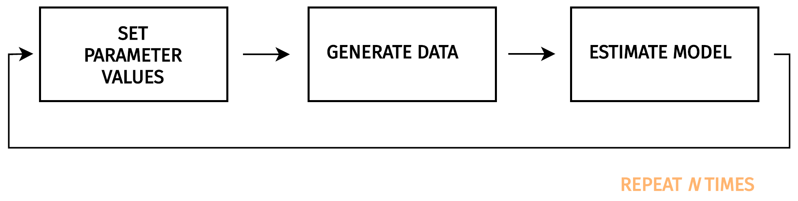
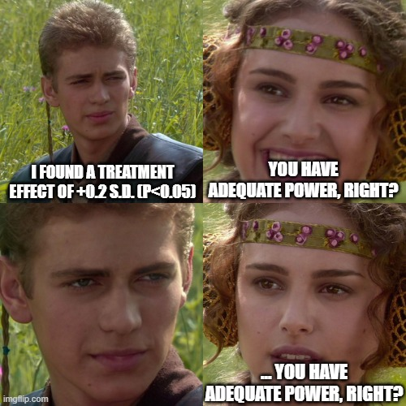

<style>
body {
text-align: justify}

h1 {
  color: #348aa7;
}

a:link, a:visited { 
  color: #348aa7; 
  text-decoration-color: #348aa7; 
  background: none;
  background: none;
  -moz-background-size: none;
  background-size: none;
  background-repeat: none;
  text-shadow: none;
  background-position: none;
}

.hljs-keyword {
  color: #348aa7;
  font-weight: bold;
}

.hljs-string {
  color: #fb8500;
}

.hljs-number {
  color: #55a630;
}
</style>

```{r setup, include=FALSE, results='hide', warning=FALSE}
library(knitr)
opts_chunk$set(cache = FALSE,
               echo = TRUE,
               message = FALSE,
               warning = FALSE,
               dev = "CairoPNG",
               dpi = 300)  

# load packages
library(here) # for file paths management
library(knitr) # for generating dynamic report
library(tidyverse) # for data manipulation and visualization
library(AER) # for running iv model
library(broom) # for cleaning statistical model output
library(retrodesign) # for retrospective power analysis

# load ggplot custom theme
source(here::here("functions", "script_theme_tufte.R"))

# define two main colors
my_orange <- "#ffbf69"
my_blue <- "#348aa7"
```


```{marginfigure}
{width=280}
Ronald Fisher, inventor of the null hypothesis testing significance framework. Its uncautious adoption in many scientific fields is still having very damaging consequences [(Stephen T. Ziliak and
Deirdre N. McCloskey, 2009)](https://www.jstor.org/stable/10.3998/mpub.186351). 
```


This tutorial focuses on a **very** important threat for empirical research: the dangers of working with studies that have a low statistical power in the null hypothesis significance testing framework (NHST). Using a toy example, we first explain why statistically significant estimates exaggerate the true effect sizes of the causal estimands of interest when data are noisy. We then show how prospective and retrospective statistical power calculations can help improve the design of our studies. Changes in attitudes towards "statistical significance" are briefly discussed at the end and further readings are provided.

# Introduction

Based on the works of [John P. A. Ioannidis et al. (2017)](https://onlinelibrary.wiley.com/doi/abs/10.1111/ecoj.12461) and [Abel Brodeur et al. (2020)](https://www.aeaweb.org/articles?id=10.1257/aer.20190687), [Paul J. Ferraro and Pallavi Shukla (2020)](https://www.journals.uchicago.edu/doi/full/10.1093/reep/reaa011) study a sample of 307 publications published between 2015-2018 in four top environmental economic journals (AER, ERE, JAERE, JEEM). In the figure below, they plot the distribution of t-statistics for 19,314 estimates:

```{r, echo = FALSE, fig.width = 6, fig.height = 3, fig.fullwidth = TRUE}
# load t-statistics data
haven::read_dta(here::here("data", "data_replication_ferraro_shukla.dta")) %>%
  group_by(studyid) %>%
  mutate(obs_by_article = n()) %>%
  group_by(studyid, table_no) %>%
  mutate(obs_by_table = n()) %>%
  group_by(studyid) %>%
  mutate(tab_by_article = length(unique(table_no))) %>%
  ungroup() %>%
  mutate(
    weight_article = 1 / obs_by_article,
    weight_table = 1 / obs_by_table * 1 / tab_by_article,
    weight_table_round = round(weight_table * 10 ^ 8)
  ) %>%
  filter(abs_tstat_sm <= 10 & main_result == 1) %>%
  ggplot(. , aes(x = abs_tstat_sm, weights = weight_table_round)) +
  geom_density(colour = my_blue) +
  geom_vline(xintercept = 1.96, colour = my_orange) +
  scale_x_continuous(breaks = scales::pretty_breaks(n = 10)) +
  xlab("Absolute t-Statistics") + ylab("") +
  theme_tufte() +
  theme(axis.text.y = element_blank(),
        axis.ticks.y = element_blank())
```

We can see on this graph that there is a drop in the distribution before the 1.96 threshold for estimates to be statistically significant at the 5% level. This is some evidence of selective reporting both by researchers and journal editors. The observed statistical significance filter is an issue because some studies in the literature are under-powered, that is they have a low probability to reject the null hypothesis of no effect. When studies are under-powered, researchers must find large effect sizes to obtain statistically significant estimates: they will exagerate the true values of the causal estimands of interest. [Paul J. Ferraro and Pallavi Shukla (2020)](https://www.journals.uchicago.edu/doi/full/10.1093/reep/reaa011) find that the median power in their sample of studies is 33% and that 56% of reported effect sizes are exaggerated by a factor of two! This is indeed worrisome.

When reading the literature on the issues raised by the combination of under-powered studies with publication bias, it is not always intuitive to understand why they are happening and how we can overcome them as applied researchers. In this tutorial, we will first see why the current use of the null hypothesis significance testing framework (NHST) leads to inflated estimates when studies have a low power. In the second and third sections, we will learn two methods to better take into account the low power issues. Prospective power analyses based on fake-data simulations allow to design better studies while retrospective power analyses help evaluate if studies are producing inflated estimates. The last section of the tutorial provides higher-level recommendations regarding our scientific practices and is followed by a curated list of resources to deepen your knowledge.


This workshop built on works I am currently carrying out with my fantastic co-author Vincent Bagilet. Should you find any errors or have questions, please do not hesitate to reach me at leo.zabrocki@psemail.com.

# Required Software & Packages

To reproduce exactly the `tutorial_power.html` document, we first need to have installed:

* the [R](https://www.r-project.org/) programming language
* [RStudio](https://rstudio.com/), an integrated development environment for R, which will allow you to knit the `tutorial_power.Rmd` file and interact with the R code chunks
* the [R Markdown](https://rmarkdown.rstudio.com/) package
* and the [tint](https://cran.r-project.org/web/packages/tint/index.html) package which provides the template of this document. 

Once everything is set up, we have to load the following packages:

```{r}
library(here) # for file paths management
library(knitr) # for generating dynamic report
library(tidyverse) # for data manipulation and visualization
library(AER) # for running iv model
library(broom) # for cleaning statistical model output
library(retrodesign) # for retrospective power analysis
```

We load our custom `ggplot2` theme for graphs, which is inspired by the one used by [Edward Tufte (1983)](https://www.edwardtufte.com/tufte/books_vdqi):

```{r, echo = TRUE}
# load ggplot custom theme
source(here::here("functions", "script_theme_tufte.R"))

# define two main colors
my_orange <- "#ffbf69"
my_blue <- "#348aa7"
```

If you do not want to use this theme, you can use the `theme_mimimal()` that is already included in the `ggplot2` package. I also recommend using the themes provided by the [hrbrthemes](https://hrbrmstr.github.io/hrbrthemes/index.html) and [mediocrethemes](https://vincentbagilet.github.io/mediocrethemes/) packages.


# Why P-Values Are Misleading in Low Power Studies

Researchers working in the null hypothesis significance testing framework (NHST) are often unaware that statistically significant estimates cannot be trusted when their studies have a low statistical power (i.e., a low probability to reject the null hypothesis of no effect when it is false). As explained by [Ioannidis (2008)](https://journals.lww.com/epidem/Fulltext/2008/09000/Why_Most_Discovered_True_Associations_Are_Inflated.2.aspx) and [Andrew Gelman and John Carlin (2014)](https://journals.sagepub.com/doi/full/10.1177/1745691614551642), when a study has a low statistical power, statistically significant estimates will be larger than the true value of the causal estimand of interest. They will even have a higher chance to be of the opposite sign! [Andrew Gelman and John Carlin (2014)](https://journals.sagepub.com/doi/full/10.1177/1745691614551642) call these two issues type M (for magnitude) and S (for sign) errors. 

**If you do not remember well what statistical power is and if type M and S errors are new concepts to you, do not worry. In this section, we will understand with a simple case study why p-values are misleading in low power studies.**

```{marginfigure}
 
Agricultural experiments played a very important role in the development of modern statistis since Ronald Fisher's works at the Rothamsted Experimental Station (UK). See the article by [Robert Langkjær-Bain (2018)](https://rss.onlinelibrary.wiley.com/doi/full/10.1111/j.1740-9713.2018.01144.x) for further historical details.
```

As a case-study, we draw our inspiration from a recent study by [Jacob R. Pecenka et al. (2021)](https://www.pnas.org/doi/10.1073/pnas.2108429118#abstract) where the authors show that, compared to conventional practices (CM), an integrated pest management system (IPM) can reduce insecticide use by 95% and even increase the yields of food crops since wild bees are conserved. We simulate such an agricultural experiment where $N$ fields are randomly allocated either to IPM or CM. Half of the fields receive the new fertilizer and are labelled as treated units. The other half are the control units. For each field, the yield of watermelons (kg/m$^2$) is measured at the end of the experiment. 


## Simulating the Data

If we denote $i$ the index of a field, the data generating process (DGP) can be summarized by:

\begin{equation*}
Y_{i}(W_i=1) = Y_{i}(W_i=0) + \tau_{i}
\end{equation*}

where $Y_{i}(0)\sim N(14, 5)$ is the potential watermelon yields (kg/m$^2$) when the field is not treated ($W_i=0$). For each field $i$, the potential watermelon yields (kg/m$^2$) when the field is treated ($W_i=1$) is created by drawing a treatment unit-causal effect from $\tau_{i} \sim N(1, 3)$. This DGP is the classic additive treatment effect model under Normality.

The `function_science_table()` simulates the Science table of the experiment according to this DGP ([Rubin, 1973](https://psycnet.apa.org/record/1975-06502-001)). Its single argument takes the desired sample size. 

```{r}
# function to create the science table
function_science_table <- function(sample_size) {
  # define field index and y(0)
  tibble(field = c(1:sample_size),
         y_0 = rnorm(sample_size, 14, 5)) %>%
    # define y(1) by adding treatment effect size
    mutate(y_1 = y_0 + rnorm(sample_size, 1, 3)) %>%
    # round values of potential outcomes
    mutate_at(vars(y_0, y_1), ~ round(., 1))
}
```

We run the function for a sample size of 50 fields:

```{r}
# set seed
set.seed(42)

# create a science table for 100 fields
data_science <- function_science_table(50)
```

And display below the 6 first units of the Science table:

```{r, echo = FALSE, fig.width = 4, fig.height = 4, fig.cap = "Distribution of Potential Outcomes.", fig.margin=TRUE}
# plot the distributions of potential outcomes
data_science %>%
  rename("Y(0)" = y_0, "Y(1)" = y_1) %>%
  pivot_longer(cols = -c(field),
               names_to = "Potential Outcomes",
               values_to = "values") %>%
  group_by(`Potential Outcomes`) %>%
  mutate(mean_outcomes = mean(values)) %>%
  ggplot(. , aes(x = `Potential Outcomes`, y = values, colour = `Potential Outcomes`)) +
  geom_boxplot()+
  geom_jitter(alpha = 0.8) +
  scale_y_continuous(breaks = scales::pretty_breaks(n = 10)) +
  scale_colour_manual(values = c(my_blue, my_orange)) +
  xlab("") + ylab(expression(paste("Yields of Watermelons (", "kg/", m^2, ")"))) +
  theme_tufte() +
  labs(colour = "Potential Outcomes:")
```

```{r, echo = FALSE}
# display the science table
data_science %>%
  mutate(individual_treatment_effect = ifelse(y_1 - y_0 < 0, y_1 - y_0, paste("+", y_1 - y_0))) %>%
  rename(
    "Field Index" = field,
    "Y(0)" = y_0,
    "Y(1)" = y_1,
    "Individual Treatment Effect" = individual_treatment_effect
  )  %>%
  slice(1:6) %>%
  kable(align = c(rep("c", 4)))
```

As we observe both potential outcomes for each field, we can compute the true value of the finite sample average treatment effect $\tau_{fs}$ as:

\begin{equation*}
\tau_{fs} = \frac{1}{N} \sum_{i=1}^{N}\left(Y_i(1) - Y_i(0) \right)
\end{equation*}

```{r}
# compute value of the ate
ate <- data_science %>%
  mutate(tau = y_1 - y_0) %>%
  summarise(mean(tau) %>% round(., 1)) %>%
  pull()
```

For this sample of 50 fields, the new pest management system increases the yields of watermelons by `r ate` (kg/m$^2$)

## Running One Iteration of the Experiment

Now that the Science table of the experiment has been created, we can run one iteration of the experiment. We first add the treatment vector to the Science table: 

```{r}
# add the treatment vector to the science table
data_science <- data_science %>%
  mutate(w = c(rep(0, n() / 2), rep(1, n() / 2))) 
```

To run one iteration of the experiment, we can randomly permute the treatment indicator. I have already stored one permutation of the treatment and we just need to load the data for this iteration:

```{r}
# load one iteration of the experiment
data_science_one_iteration <- readRDS(here::here("data", "data_science_one_iteration.rds"))
```

Once the treatment has been allocated, we express the observed watermelon yields $Y^{obs}$ such that:

\begin{equation*}
Y^{obs}_{i} = W_{i}\times Y_{i}(1) + (1-W_{i})\times Y_{i}(0)
\end{equation*}

```{r}
# express observed yields
data_science_one_iteration <- data_science_one_iteration %>%
  mutate(y_obs = w * y_1 + (1 - w) * y_0)
```

To estimate the average causal effect, we compute the difference in the average yields between treated and control units $\hat{\tau}$:

\begin{equation*}
\hat{\tau} = \frac{1}{N_{t}} \sum_{i|W_{i}=1} Y_i^{obs} - \frac{1}{N_{c}} \sum_{i|W_{i}=0} Y_i^{obs}
\end{equation*}

where $N_{t}$ and $N_{c}$ are respectively the sample size of treated and control groups. To compute the variance of the estimator $\hat{\tau}$, we use Neyman's estimator:


\begin{equation*}
\hat{\mathbb{V}}(\hat{\tau}) = \frac{\frac{1}{N_{c}-1} \sum_{i|W_{i}=0} \left(Y_i^{obs} - \bar{Y_{c}} \right)^2}{N_{c}} + \frac{\frac{1}{N_{t}-1} \sum_{i|W_{i}=1} \left(Y_i^{obs} - \bar{Y_{t}} \right)^2}{N_{t}}
\end{equation*}

And compute a 95% confidence intervals with a normal approximation:

\begin{equation*}
\text{CI}_{0.95}(\tau_{fs}) = (\hat{\tau}-1.96\sqrt{\hat{\mathbb{V}}}, \hat{\tau}+1.96\sqrt{\hat{\mathbb{V}}})
\end{equation*}

We can compute the point estimate for the treatment effect and the 95% confidence interval with the following code:

```{r}
# compute estimate for ate
estimate_ate <- data_science_one_iteration %>%
  group_by(w) %>%
  summarise(group_mean = mean(y_obs)) %>%
  summarise(group_mean[2] - group_mean[1]) %>%
  pull()

# compute associated standard error
standard_error <- data_science_one_iteration %>%
  group_by(w) %>%
  mutate(
    n_obs = n(),
    average_y_obs = mean(y_obs),
    squared_difference = (y_obs - average_y_obs) ^
      2,
    variance_group = sum(squared_difference) / (n_obs - 1)
  ) %>%
  summarise(variance_component = mean(variance_group / n_obs)) %>%
  summarise(variance = sum(variance_component),
            standard_error = sqrt(variance)) %>%
  pull(standard_error)

# return ate estimate and 95% confidence interval
results_one_iteration <- tibble(
  estimate_ate = estimate_ate,
  lower_95_ci = estimate_ate - 1.96 * standard_error,
  upper_95_ci = estimate_ate + 1.96 * standard_error
) %>%
  mutate_all( ~ round(., 1))
```


We find an average increase increase of `r results_one_iteration$estimate_ate` kg/m$^2$ (95\%: `r results_one_iteration$lower_95_ci`, `r results_one_iteration$upper_95_ci`). However, we know that the true value of the average treatment effect is + `r ate` kg/m$^2$. So, we got a statistically significant estimate at the 5% level but it exaggerates the true value of the effect size of interest!

To understand why statistically significant estimates are misleading in this experiment, we can replicate it many times.

## Replicating Many Times the Experiment

In our complete experiment, there are $\frac{N!}{N_{t}!(N-N_{t})!}$ ways to allocate the treatment, which is a huge number. We cannot compute all possible allocation and for simplicity, we only replicate the experiment 1000 times. 

The code below carries out the replication

```{r, eval = FALSE}
# set the seed
set.seed(42)

# load function to carry out the experiment
source(here::here("functions", "script_function_complete_experiment.R"))

# run 1000 experiments
data_results_1000_experiments <-
  rerun(1000, function_complete_experiment(data_science)) %>%
  bind_rows()

# add if the point estimate is statistically significant at the 5% level
data_results_1000_experiments <- data_results_1000_experiments %>%
  mutate(significant = ifelse(lower_95_ci < 0 & 0 < upper_95_ci, 0, 1))
```

To save time, I have already stored the results:

```{r}
# load 1000 iterations of the experiment
data_results_1000_experiments <- readRDS(here::here("data", "data_results_1000_experiments.rds"))

# add iteration index
data_results_1000_experiments <- data_results_1000_experiments %>%
  mutate(iteration = 1:1000) %>%
  mutate(significant = ifelse(significant == 1, "True", "False"))
```

We can plot the point estimates of the 1000 replications and color them according to their statistical significance at the 5% level:

```{r, echo = FALSE, fig.width=8, fig.height=5, fig.fullwidth = TRUE}
# make the graph
graph_experiment_results_dots <-
  ggplot(
    data_results_1000_experiments,
    aes(x = iteration, y = estimate_ate, color = significant)
  ) +
  geom_hline(yintercept = mean(data_results_1000_experiments$estimate_ate),
             size = 0.25,
             colour = "black") +
  geom_point(shape = 16,
             size = 1,
             alpha = 0.8) +
  scale_color_manual(name = "Statistically Significant at the 5% Level", values = c(my_blue, my_orange)) +
  scale_x_continuous(breaks = scales::pretty_breaks(n = 10)) +
  scale_y_continuous(breaks = scales::pretty_breaks(n = 14)) +
  xlab("Iteration") + ylab("Estimate") +
  theme_tufte() +
  guides(colour = guide_legend(override.aes = list(alpha = 1, size = 3)))

# display the graph
graph_experiment_results_dots
```


```{r, echo = FALSE, fig.width = 4, fig.height = 10, fig.cap = "Alternative visualization of the first 100 replication of the experiment. The grey line is the true value of the causal estimand.", fig.margin=TRUE}
# create the graph
graph_ci <- data_results_1000_experiments %>%
  slice(1:100) %>%
  ggplot(
    .,
    aes(
      x = iteration,
      colour = significant,
      y = estimate_ate,
      ymin = lower_95_ci,
      ymax = upper_95_ci
    )
  ) +
  geom_hline(yintercept = 0, colour = "black") +
  geom_hline(yintercept = ate, colour = "grey") +
  geom_pointrange(lwd = 0.3) +
  scale_colour_manual(values = c(my_blue, my_orange)) +
  scale_x_continuous(breaks = scales::pretty_breaks(n = 10)) +
  scale_y_continuous(breaks = scales::pretty_breaks(n = 15)) +
  coord_flip() +
  xlab("") + ylab("Estimate") +
  theme_tufte() +
  theme(
    legend.position = "none",
    axis.text.y = element_blank(),
    axis.ticks.y = element_blank()
  )

# display the graph
graph_ci
``` 

The black line on this graph is the average of all estimates: reassuringly, it is equal to the true value of the causal effect. If we were able to replicate several times the experiment, we will recover the true value of the causal effect of the new pest management system on watermelon yields. However, researchers and editors most of the time do not take into account the blue dots on this graph. They only consider the yellow dots, estimates that are statistically significant estimates at the 5% level, as evidence of successful experiments. In our case study, this is worrisome since **all** statistically significant estimates overestimate the true effect size: these are type M errors. We would think that we have carried out a successful experiment but we would overestimate the impact of the new pest management system on watermelon yields. Besides, a fraction of significant estimates are of the wrong sign! They are type S errors. For some replications of the experiment, we could actually conclude that the treatment has the opposite effect. 


Now, the intuition of why statistically significant estimates are misleading in this experiment should become clearer. In this experiment, the probability to reject the null hypothesis of no effect is very low: most estimates have large confidence confidence intervals that cross the 0 line. With such an amount of noise, estimate that are at least two standard errors away from zero are very off the true treatment effect size.


## Defining and Computing Statistical Power, Type M and S Errors

[Ioannidis (2008)](https://journals.lww.com/epidem/Fulltext/2008/09000/Why_Most_Discovered_True_Associations_Are_Inflated.2.aspx) and [Andrew Gelman and John Carlin (2014)](https://journals.sagepub.com/doi/full/10.1177/1745691614551642) showed with simulations the dangers of working with under-powered studies. [Lu et al. (2019)](https://bpspsychub.onlinelibrary.wiley.com/doi/abs/10.1111/bmsp.12132) and [Zwet and Cator (2021)](https://onlinelibrary.wiley.com/doi/full/10.1111/stan.12241) recently formalized the results of the simulations.


First, the statistical power for rejecting the null hypothesis $H_{0} : \tau_{fs} = 0$ is given by:

\begin{equation*}
\Phi(−1.96 − \frac{\tau_{fs}}{s}) + 1 − \Phi(1.96 − \frac{\tau_{fs}}{s})
\end{equation*}

with $s$ the standard error of our estimate $\hat{\tau}$ and $\Phi$ the cumulative function of the standard normal distribution. In a real study, the issue is that we never know what the true value of the causal estimand is so we cannot compute what the power of the study is. In our case, we know the true value of $\tau_{fs}$ and we can take the standard error of the first iteration as the value for $s$:

```{r}
# retrieve standard error of the first experiment iteration
s <- (results_one_iteration$upper_95_ci - results_one_iteration$estimate_ate) / 1.96

# compute power using its definition
power_formula <- (pnorm(-1.96 - 1.3 / s) + 1 - pnorm(1.96 - 1.3 / s)) * 100
``` 

Given the definition of statistical power and the values we put in the formula, we find that the power of our experiment is equal to `r round(power_formula, 0)` %. We can also compute the statistical power of the experiment using the results of our simulations: we just need to count the proportion of estimates that are statistically significant at the 5% level.

```{r}
# compute power using simulation results
power_simulation <- data_results_1000_experiments %>%
  summarise(statistical_power = round(sum(significant == "True") / n() * 100, 0))
```

Using simulation results, we find that the power is equal to `r power_simulation`, which is relatively similar to the power found using its formula. Our field experiment is very under-powered: in our first iteration of the experiment, we had actually very few chances to get a "statistically significant" result. 

We can then look at the characteristics of the statistically significant estimates. We can compute the average type M error which is defined as:

\begin{equation*}
\mathbb{E}\left(\frac{|\hat{\tau}|}{|\tau_{fs}|} | \tau_{fs}, s, |\hat{\tau}|/s>1.96 \right)
\end{equation*}


Using our simulation results, we can compute the value of this metric:

```{r}
# compute average type m error
type_m <- data_results_1000_experiments %>%
  filter(significant == "True") %>%
  summarise(exageration_factor = mean(abs(estimate_ate) / ate) %>% round(., 1))
```

On average, statistically significant estimates exaggerate the true effect size by a factor of about `r type_m`. As the experiment is very under-powered, estimates need to be very far away from 0 to reach statistical significance. They are therefore also far away from the true value of the causal estimand.

We can also compute the probability to make a type S error, that is to say the probability that the estimate is of the opposite sign of $\tau_{fs}$. It is defined as:

\begin{equation*}
\frac{\Phi(-1.96-\frac{\tau_{fs}}{s})}{1-\Phi(1.96-\frac{\tau_{fs}}{s}) + \Phi(-1.96 - \frac{\tau_{fs}}{s})}
\end{equation*}

Again, we can compute the probability commit a type S error using our simulation results:

```{r}
# compute probability to make a type s error
type_s <- data_results_1000_experiments %>%
  filter(significant == "True") %>%
  summarise(probability_type_s_error = round(sum(estimate_ate < 0) / n() * 100, 1))
```

`r type_s`% of statistically significant estimates are negative. The probability to make a type S error with this experiment is relatively small.

## How Type M and S Errors Evolve with Power

Type M and S errors should make us worried to work with under-powered studies and only consider statistically significant estimates. It is therefore important to understand how type M and S errors evolve with statistical power. [Lu et al. (2019)](https://bpspsychub.onlinelibrary.wiley.com/doi/abs/10.1111/bmsp.12132) and [Zwet and Cator (2021)](https://onlinelibrary.wiley.com/doi/full/10.1111/stan.12241) show formally the relationship between the three metrics. Here, we again rely on simulations.

To improve the power of a study, many strategies can be implemented. We could use a different randomization scheme such a blocked or pairwise assignment. We could also exploit information on previous years watermelon yields. And, of course, we could increase the sample size of the experiment. Here, we rerun our agricultural experiment for increasing sample sizes:

```{r, eval = FALSE}
# set the seed
set.seed(42)

# load function to carry out the experiment
source(here::here("functions", "script_function_complete_experiment.R"))

# add to science table function the treatment indicator
function_science_table <- function(sample_size) {
  # define field index and y(0)
  tibble(field = c(1:sample_size),
         y_0 = rnorm(sample_size, 14, 5)) %>%
    # define y(1) by adding treatment effect size
    mutate(y_1 = y_0 + rnorm(sample_size, 1, 3)) %>%
    # round values of potential outcomes
    mutate_at(vars(y_0, y_1), ~ round(., 1)) %>%
    # add treatment indicator
    mutate(w = c(rep(0, n() / 2), rep(1, n() / 2)))
}

# function to compute value of the ate
function_ate <- function(data) {
  ate <- data %>%
    mutate(tau = y_1 - y_0) %>%
    summarise(mean(tau) %>% round(., 1)) %>%
    pull()
}

# run 1000 simulations for each sample size
data_power_sample_size_sim <- tibble(sample_size = seq(from = 100, to = 1000, by = 100)) %>%
  mutate(data = map(sample_size, ~ function_science_table(.))) %>%
  mutate(ate = map(data, ~ function_ate(.))) %>%
  mutate(results = map( data, ~ rerun(10000, function_complete_experiment(.)) %>% bind_rows(.))) %>%
  select(-data) %>%
  unnest(c(ate, results))

# add if the point estimate is statistically significant at the 5% level
data_power_sample_size_sim <- data_power_sample_size_sim %>%
  mutate(significant = ifelse(lower_95_ci < 0 & 0 < upper_95_ci, 0, 1))

# save results
saveRDS(data_power_sample_size_sim, here::here("data", "data_power_sample_size_sim.rds"))
```

To save time, I have already stored the results:

```{r}
# load simulations of the experiment for increasing sample sizes
data_power_sample_size_sim <- readRDS(here::here("data", "data_power_sample_size_sim.rds"))
```

For each sample size, we compute the power, type M and S errors:

```{r}
# compute power, type m and s errors
summary_power_sample_size_sim <- data_power_sample_size_sim %>%
  group_by(sample_size) %>%
  summarise(
    power = mean(significant == 1, na.rm = TRUE) * 100,
    type_m = mean(ifelse(
      significant == 1, abs(estimate_ate / ate), NA
    ), na.rm = TRUE),
    type_s = sum(ifelse(
      significant == 1, sign(estimate_ate) != sign(ate), NA
    ), na.rm = TRUE) / n() * 100
  )
```

We plot how power and type M error evolve with sample size (the probability of making a type S error is nearly null for all simulations):

```{r, echo = FALSE, fig.width=8, fig.height=3, fig.fullwidth = TRUE}
# make the graph
summary_power_sample_size_sim %>%
  pivot_longer(cols = -c(sample_size, type_s),
               names_to = "metric",
               values_to = "value") %>%
  mutate(metric = ifelse(metric == "power", "Power (%)", "Type M Error")) %>%
  ggplot(.,
         aes(x = sample_size, y = value)) +
  geom_point(colour = my_blue) +
  scale_x_continuous(breaks = scales::pretty_breaks(n = 10)) +
  scale_y_continuous(breaks = scales::pretty_breaks(n = 14)) +
  facet_wrap( ~ metric, nrow = 1, scales = "free_y") +
  xlab("Sample Size") + ylab("") +
  theme_tufte()
```

We see that as the sample size increases, statistical power increases. This is obvious. We also see that as power increases, the average type M error decreases. This is very important since it means that we should make sure to work with high-powered studies if we want to be more confident in the magnitude of statistically significant estimates. 


In their seminal paper, [Andrew Gelman and John Carlin (2014)](https://journals.sagepub.com/doi/full/10.1177/1745691614551642) provide an alternative visualization where they plot Type S and M errors against power:

```{r, echo=FALSE, out.width = '150%'}

```

When statistical power is below 10%, the probability to make a type S error explodes. Type M error arises for power below 50%. 

Type M and S errors are arguably two issues that have been overlooked by researchers. Fortunately, solutions exists to design better studies with respect to low power issues, but also to evaluate if a study could run into these problems once it has been carried out.

# Prospective Power Analysis

```{marginfigure}
 
```

To avoid running into type M and S errors, we need to design studies with enough statistical power. This is often done in randomized controlled trials as they need to display their power for being pre-registered but also to be funded. We start this section with the standard approach based on statistical formula and move to a much more modern and flexible approach based on simulations.

## Standard Approach

In statistics courses, you may have come across formulas to compute the statistical power of a study. Below, I am reproducing the formula and its associated code found in a method guide by the [Evidence in Governance and Politics](https://egap.org/resource/10-things-to-know-about-statistical-power/). Another very clear explanation of the power formula for a complete randomized experiment can be found in Section 7.1 of [Susan Athey and Guido W. Imbens (2016)](https://arxiv.org/pdf/1607.00698.pdf).


\begin{equation*}
\beta = \Phi\left(\frac{|\mu_{t}-\mu_{c}|\sqrt{N}}{2\sigma} - \Phi^{-1}(1-\frac{\alpha}{2})\right)
\end{equation*}

* $Phi$ is the cumulative distribution function of the normal distribution.
* $\mu_t$ and $mu_c$ are the average outcomes of the treatment and control groups.
* $\sigma$ is the standard deviation of the outcome. Here, we assume that it is the same for both groups.
* $\alpha$ is the significance level.
* $N$ is the number of units.

The code below implements the formula:

```{r}
# power formula for complete experiment
power_calculator <- function(mu_t, mu_c, sigma, alpha = 0.05, N) {
  lowertail <- (abs(mu_t - mu_c) * sqrt(N)) / (2 * sigma)
  uppertail <- -1 * lowertail
  beta <- pnorm(lowertail - qnorm(1 - alpha / 2), lower.tail = TRUE) + 1 - pnorm(uppertail - qnorm(1 - alpha / 2), lower.tail = FALSE)
  return(beta)
} 
```

We can use this formula for our previous agricultural experiment:

```{r}
# computing power of our agricultural experiment
power_calculator(mu_t = 15, mu_c = 14, sigma = 5, alpha = 0.05, N = 100)
```

If the average watermelon yields is 15 kg/m$^2$ in the treatment group, 14 kg/m$^2$ in the control group and if the standard deviation of the outcome is 5 kg/m$^2$, we would have a power of 17% for a sample size of 100 fields.

The issue of this type of formula is that they are hard to adapt to more complex research designs. This is the reason why political scientists at [EGAP](https://egap.org/resource/10-things-to-know-about-statistical-power/) and leading statisticians advocate relying on data simulations [(Andrew Gelman, Jennifer Hill and Aki Vehtari, 2020)](https://www.cambridge.org/highereducation/books/regression-and-other-stories/DD20DD6C9057118581076E54E40C372C#overview).

## Simulation-Based Approach: Health Effects of Forest Fires


```{marginfigure}
Do not hesitate to reach Vincent if you have any questions regarding simulating data from scratch. He is a R wizard..
```

Approximating a research design with fake-data simulations is not very difficult but requires (i) 
a specific workflow and (ii) thinking about the relevant distribution of the variables of interest. We are relying here on the R workflow developed by [Vincent Bagilet](https://vincentbagilet.github.io/) that can be summarized with the following diagram:


```{r, echo=FALSE, out.width = '100%'}

```

1. In the first step, we set the parameters values such as the mean and standard deviation of variables and the strengths of their relationships.
2. In the second step, we generate the data using the statistical model that we want to run.
3. In the third step, we estimate the model on the data that have been generated. We then repeat this procedure $N$ times to compute power, type M and S errors.

```{marginfigure}

Forest Fires in Summatra in September 27, 2006. [Source: NASA’s Aqua satellite.](https://earthobservatory.nasa.gov/images/17434/fires-on-sumatra). This example is inspired by [Tamara L. Sheldon and
Chandini Sankaran (2017)](https://www.aeaweb.org/articles?id=10.1257/aer.p20171134) who study the impact of Indonesian forest fires on air pollution and polyclinic attendance in Singapore.
```

As an example, we try to simulate a study on the impact of forest fires on daily emergency admissions for respiratory symptoms in a large city. The DGP for the daily emergency admission on day $t$, $Emergency_t$ is defined as follows:


$$Emergency_{t} = \alpha + \beta Pollution_{t} + \delta u_{t} + e^{(E)}_{t}$$

Where $\alpha$ is a constant, $u$ represents an unobserved variable and $e^{(E)} \sim \mathcal{N}(0, \sigma_{e_E})$ the noise. $\beta$ is the parameter of interest, the treatment effect of air pollution on the number of emergency admission.

The DGP for the air pollution data is as follows: 

$$Pollution_{t} = \gamma + \lambda Fire_{t} + \eta u_{t} + e^{(P)}_{t}$$

Where $\mu$ is a constant, $Fire$ is the fire radiative power and $e^{(P)} \sim \mathcal{N}(0, \sigma_{e_P})$ the noise. We refer to $\lambda$ as the strength of the instrumental variable. Air pollution is the concentration in $\mu g/m^3$ in coarse particulate matter (PM$_{10}$).

The impact of air pollution on emergency admission is estimated using a 2 stage least squares model

More precisely, we set: 

- $N$ the number of daily observations.
- $Fire \sim \text{Gamma}(k, \theta)$. We use a gamma distribution to create a very right skewed distribution of fire radiative power. 
- $u \sim \mathcal{N}(0, \sigma_{u}^{2})$ the unobserved variable.
- $e^{(S)} \sim \mathcal{N}(0, \sigma_{e_S}^{2})$.
- $e^{(T)} \sim \mathcal{N}(0, \sigma_{e_T}^{2})$.

We generate the data using the `generate_data_IV()` function:

```{r}
# generate IV data
generate_data_IV <- function(N,
                             param_fire,
                             sigma_u,
                             sigma_ee,
                             sigma_ep,
                             alpha,
                             gamma,
                             treatment_effect,
                             iv_strength,
                             ovb_intensity) {
  # first create day index
  data <- tibble(id = 1:N) %>%
    mutate(
      # create fire radiative power from a gamma distribution
      fire = rgamma(N, shape = param_fire[1], scale = param_fire[2])*50000,
      # create the unobserved variable
      u = rnorm(nrow(.), 0, sigma_u),
      # random noise for the emergency model
      e_e = rnorm(nrow(.), 0, sigma_ee),
      # random noise for the air pollution model
      e_p = rnorm(nrow(.), 0, sigma_ep),
      # create air pollution variable
      pollution = gamma + iv_strength * fire + ovb_intensity * u + e_p,
      # create emergency admission variable
      emergency = alpha + treatment_effect * pollution + ovb_intensity * u + e_e
    )
  
  return(data)
}
```

Below are the parameters values that we use:

```{r simple_param_IV, echo=FALSE}
baseline_param_IV <- tibble(
  N = 3650,
  param_fire = list(c(1, 2)),
  sigma_u = 1,
  sigma_ee = 100,
  sigma_ep = 5,
  alpha = 400,
  gamma = 30,
  treatment_effect = 1,
  iv_strength = 10/100000, 
  ovb_intensity = 0.4
)
baseline_param_IV %>% kable(align = c(rep("c", 10)))
```

And we simulate one dataset to explore its properties:

```{r}
# set seed
set.seed(42)

# simulate one dataset
data_fire <- baseline_param_IV %>%
  pmap_dfr(generate_data_IV)
```

We plot the density distribution of the main variables:

```{r, echo = FALSE, fig.width=14, fig.height=4, fig.fullwidth = TRUE}
# make the graph
data_fire %>%
  pivot_longer(cols = c(fire, pollution, emergency),
               names_to = "metric",
               values_to = "value") %>%
  mutate(metric = case_when(metric == "fire" ~ "FRP (MV)",
                            metric == "pollution" ~ "PM10 (µg/m³)",
                            metric == "emergency" ~ "Emergency Admission (N)")) %>%
  ggplot(.,
         aes(x = value)) +
  geom_density(colour = my_blue) +
  scale_x_continuous(breaks = scales::pretty_breaks(n = 10), labels = scales::scientific) +
  facet_wrap( ~ metric, nrow = 1, scales = "free") +
  xlab("Value of the Variable") + ylab("") +
  theme_tufte() +
  theme(axis.text.y = element_blank(),
        axis.ticks.y = element_blank())
```

The distribution of the variables seem relatively realistic. We can now check the relationship between the variables. First, we can check the effect of forest fires on air pollution:

```{r}
# check effect of forest fires on air pollution
data_fire %>%
  mutate_at(vars(fire, pollution), ~ scale(.)) %>%
  lm(pollution ~ fire + u, data = .) %>%
  broom::tidy(., conf.int = TRUE) %>%
  filter(term == "fire")
```

A one standard deviation increase in the fire radiative power increases the concentration of PM$_{10}$ by about 0.46 standard deviation. We can then check the effect of instrumented air pollution on emergency admission:

```{r}
# check effect of instrumented air pollution on emergency admission
data_fire %>%
  mutate_at(vars(fire, pollution), ~ scale(.)) %>%
  AER::ivreg(data = .,
                       formula = log(emergency) ~ pollution | fire) %>%
  broom::tidy(., conf.int = TRUE) %>%
  filter(term == "pollution")
```

A one standard deviation in instrumented air pollution increases emergency admission by 6%. These figures make sense. Of course, we simulated this dataset in a very basic way: we did not simulate the temporal auto-correlation of the data and we did not use the Rubin Causal Model. It is always relevant to start from a basic simulation procedure and then make it more complex as needed.

We create below the function `estimate_IV()` to estimate the IV model in our simulations:

```{r}
# estimate IV model
estimate_IV <- function(data) {
  reg_IV <- AER::ivreg(data = data,
                       formula = emergency ~ pollution | fire)
  
  fstat_IV <- summary(reg_IV,
                      diagnostics = TRUE)$diagnostics["Weak instruments", "statistic"]
  
  reg_IV <- reg_IV %>%
    broom::tidy(., conf.int = TRUE) %>%
    mutate(fstat = fstat_IV) %>%
    filter(term == "pollution") %>%
    rename(p_value = p.value, se = std.error, conf_low = conf.low, conf_high = conf.high) %>%
    select(estimate, p_value, se, conf_low, conf_high, fstat) %>%
    
    return(reg)
}
```

We combine the functions `generate_data_IV` and `estimate_IV` into a single function `compute_sim_IV` to run our simulations:

```{r}
# define compute_sim_IV
compute_sim_IV <- function(N,
                           param_fire,
                           sigma_u,
                           sigma_ee,
                           sigma_ep,
                           alpha,
                           gamma,
                           treatment_effect,
                           iv_strength,
                           ovb_intensity) {
  generate_data_IV(
    N = N,
    param_fire = param_fire,
    sigma_u = sigma_u,
    sigma_ee = sigma_ee,
    sigma_ep = sigma_ep,
    alpha = alpha,
    gamma = gamma,
    treatment_effect = treatment_effect,
    iv_strength = iv_strength,
    ovb_intensity = ovb_intensity
  ) %>%
    estimate_IV() %>%
    mutate(
      iv_strength = iv_strength,
      ovb_intensity = ovb_intensity,
      true_effect = treatment_effect
    )
} 
```

We are now ready to run some Monte Carlo simulations. We just need to set the values of the parameter we want to vary. For instance, we can vary the strength of the IV:

```{r}
# set vector of iv strengths
vect_iv_strength <- c(1, 2, 3, 4, 5, 10) / 100000

# number of iterations
n_iter <- 500

# create parameters of the simulations
param_IV <- baseline_param_IV %>%
  select(-iv_strength) %>%
  crossing(vect_iv_strength) %>%
  rename(iv_strength = vect_iv_strength) %>%
  crossing(rep_id = 1:n_iter) %>%
  select(-rep_id)
```

We then run the simulations by mapping our `compute_sim_IV` function on `param_IV`:

```{r, eval=FALSE}
# run power simulations
sim_IV <- pmap_dfr(param_IV, compute_sim_IV)
```

To save time, we have already stored the simulation results:

```{r}
# load simulations data
sim_IV <- readRDS(here::here("data", "data_sim_power_fire.rds"))
```

We define the `summarise_simulations()` to compute power, type M error, the first-stage F-statistics but also the mean width of 95% confidence intervals:

```{r}
# summary relevant metrics
summarise_simulations <- function(data) {
  data %>%
    mutate(significant = (p_value <= 0.05)) %>% 
    group_by(ovb_intensity, iv_strength) %>%
    summarise(
      power = mean(significant, na.rm = TRUE)*100, 
      type_m = mean(ifelse(significant, abs(estimate/true_effect), NA), na.rm = TRUE),
      mean_fstat = mean(fstat, na.rm = TRUE),
      mean_width_ci = mean(abs(conf_high - conf_low)),
      .groups	= "drop"
    ) %>% 
    ungroup()
} 
```

We run the function:

```{r}
# run summarise_simulations
summary_sim_IV <- summarise_simulations(sim_IV)
```

And display below the results:

```{r, echo = FALSE}
# display simulation results
summary_sim_IV %>%
  select(-ovb_intensity) %>%
  mutate_at(vars(power, type_m, mean_width_ci), ~ round(., 1)) %>%
  mutate(mean_fstat = round(mean_fstat, 0)) %>%
  rename(
    "Strength of the IV" = iv_strength,
    "Power (%)" = power,
    "Average Type M Errror" = type_m,
    "Mean F-Statistic" = mean_fstat,
    "Mean Width of 95% CI" = mean_width_ci
  ) %>%
  kable(align = c(rep("c", 6)))
```

As we increase the strength of the instrumental variable, we can see that power increases and type M error decreases. This type of simulations could help you think about the strength of the IV required to avoid low power issues given a sample size. Looking at the evolution of the width of 95% confidence intervals with the IV strength is also very important as we are more interested about the precision of effects than just rejecting the null hypothesis of no effect: if we design a study, we want to get narrow confidence intervals to reduce the range of potential values for the causal estimand of interest.

In this section, we carried out a very basic prospective power simulation. It would be also interesting to look at other factors influencing the power of the study such as the sample size, the distribution of variables, etc... A prospective power simulation is a very good occasion to think about the data that you are going to collect but also the type of statistical models you would like to use. This procedure increases your knowledge before analyzing the actual data. It is still rarely implemented, which is a shame as it is not so hard to get some insights with rough simulations. If you really fear that the data you are going to work with are too complex, you can implement power simulations on existing datasets. This is what [Jennifer Hill (2011)](https://www.tandfonline.com/doi/abs/10.1198/jcgs.2010.08162?journalCode=ucgs20) does to explore the properties of Bayesian Additive Regression Trees: take a look at her great article if you want a template!

# Retrospective Power Analysis

```{marginfigure}
 
```

Implementing a prospective power analysis requires thinking in advance about the design of a study, collecting summary statistics, and coding skills. Contrary to randomized controlled trial where statistical power computation are required for a study to be funded, researchers are not incentivized to carry out such an analysis with observational data. Fortunately, they can still evaluate whether their studies are robust to low power issues with a **retrospective** power analysis. 

Imagine that we have analyzed observational data with a particular causal inference method. The true causal effect is $\beta$ and we found an estimate $\hat{\beta}$ with a standard error $s$. The estimate is statistically significant at the 5% level. Of course, if we think that $\beta = \hat{\beta}$, we had enough power to reject the null hypothesis since we got a statistically significant estimate. It is more relevant to think about the power of the study against alternative but plausible values of $\beta$ such that $\beta<\hat{\beta}$. Computing the statistical power but also type M and S errors only requires to draw many estimates from a normal distribution centered around the hypothesized true effect $\beta$ and with a standard deviation equal to the obtained standard error $s$. Concretely, we proceed as if we were able to replicate the study many times under
the assumptions that (i) the true effect is different from the observed estimate and (ii) other paratmeters of the research design remain fixed.

In R, the [retrodesign](https://cran.r-project.org/web/packages/retrodesign/vignettes/Intro_To_retrodesign.html) package implements the closed-form expression derived by [Lu et al. (2019)](https://bpspsychub.onlinelibrary.wiley.com/doi/abs/10.1111/bmsp.12132) to avoid relying on simulations.

## Heat and Learning

As a first example, we take a study by [R. Jisung Park et al. (2020)](https://pubs.aeaweb.org/doi/pdfplus/10.1257/pol.20180612) on the impact of heat on students learning. The authors found that *"on average in the United States, experiencing a 1°F hotter school year lowers academic achievement by 0.002 standard deviations [...] the average gain in PSAT score performance between tenth and eleventh grade is about 0.3 standard deviations, implying that a 1°F hotter school year reduces learning by close to 1 percent of the expected gains over that year"*.

If we take their more robust specification where they only focus on students within five-miles of a weather stations, their point estimate is equal to a decrease by 0.0023 standard deviation in PSAT scores, with a standard error equal to 0.00042. If we compute a 95% confidence interval, it means that their data are consistent with effect sizes ranging from -0.003 up to -0.0015. Extra heat would reduce learning between -1% and -0.5% of the expected gains over that
year. The authors have a huge sample size of 20 millions observations so that their results are precise. 

To think about the retrospective power of the study, we could need to have a credible guess of where the true effect size lies. Usually, we could use point estimates of other studies if they are based on better methods or large sample sizes. We could also rely on results from meta-analyses. Here, we proceed as if we had little external information to inform our prior. 

First, we could check what would happen if the true effect size was actually 25% smaller than the observed estimate. Using the `retro_design()` function, we only need to give a list of potential true values *A* and the value of the standard error *s* of the point estimate.

```{r, eval = FALSE}
# compute power for a reduction of 25% of the point estimate
retro_design(A = -0.0023*0.75, s = 0.00042, alpha = 0.05)
```


```{r, echo = FALSE}
# compute power for a reduction of 25% of the point estimate
retro_design(A = -0.0023 * 0.75,
             s = 0.00042,
             alpha = 0.05) %>% as_tibble() %>% mutate_all( ~ round(., 2)) %>% kable(align = c(rep("c", 4)))
```

If the true value of the causal effect of heat on learning was 25% smaller than the observed estimate, the study would be extremely well-powered. As a second check, we could take the lower bound of the 95% confidence interval as the true value of the point estimate: it represents a decrease by 0.5% of the expected gains in learning over a year. We could argue that the authors would have still published their paper with such an effect size.

```{r, echo = FALSE}
# compute power for lower bound of 95% ci
retro_design(A = -0.0015,
             s = 0.00042,
             alpha = 0.05) %>% as_tibble() %>% mutate_all( ~ round(., 2)) %>% kable(align = c(rep("c", 4)))
```

Again, with their sample size, they do not run into any low power issues. Finally, other researchers could be really skeptical about the results of [R. Jisung Park et al. (2020)](https://pubs.aeaweb.org/doi/pdfplus/10.1257/pol.20180612) and claim that the true effect size should be closer to a 0.1% decrease of the expected gains in learning.

```{r, echo = FALSE}
# compute power for an effect size of -0.1%
retro_design(A = -0.0003,
             s = 0.00042,
             alpha = 0.05) %>% as_tibble() %>% mutate_all( ~ round(., 2)) %>% kable(align = c(rep("c", 4)))
```

If that was the case, the power of the study would be very low (11%), the probability to make a Type S error is 3% and the average Type M error is 3.4. Of course, all studies will run into low power issues if the true effect size is very small: other researchers need to argue why they would think that an effect size of a 0.1% decrease makes sense.

We think that it would beneficial if researchers reported graphs of power, type M and S errors against a range of alternative effect sizes so that readers can directly think about power issues. The graph below is an example for the study by [R. Jisung Park et al. (2020)](https://pubs.aeaweb.org/doi/pdfplus/10.1257/pol.20180612). The vertical orange line is the observed estimate.

```{r, echo = FALSE, fig.width=9, fig.height=3.5, fig.fullwidth = TRUE}
# compute the power, type m and s errors for a range of effect sizes
data_retro <-
  retro_design(as.list(seq(-0.0023, -0.0003, by = 0.0001)), 0.00042) %>%
  unnest(cols = c(effect_size, power, type_s, type_m)) %>%
  mutate(power = power * 100,
         type_s = type_s * 100) %>%
  rename(
    "Statistical Power (%)" = power,
    "Type-S Error (%)" = type_s,
    "Type-M Error (Exaggeration Ratio)" = type_m
  ) %>%
  pivot_longer(
    cols = -c(effect_size),
    names_to = "statistic",
    values_to = "value"
  )

# make graph
  ggplot(data_retro, aes(x = effect_size, y  = value)) +
  geom_line(colour = my_blue) +
  geom_vline(xintercept = -0.0023, colour = my_orange) +
  scale_y_continuous(breaks = scales::pretty_breaks(n = 10)) +
  facet_wrap( ~ statistic, scales = "free") +
  xlab("Hypothetical True Effect Size") + ylab("") +
  theme_tufte()
```

## Price Elasticity of Gasoline Demand

A retrospective power analysis becomes very credible when we have results from meta-analysis to inform our guess about the true value of the causal estimand of interest. For instance, [Tomas Havranek et al. (2012)](https://www.sciencedirect.com/science/article/pii/S0140988311002040) carry out a meta-analysis of the price elasticity of gasoline demand. Below is the abstract and main results of their paper:


> One of the most frequently examined statistical relationships in energy economics
has been the price elasticity of gasoline demand. We conduct a quantitative survey
of the estimates of elasticity reported for various countries around the world. Our
meta-analysis indicates that the literature suffers from publication selection bias: in-
significant or positive estimates of the price elasticity are rarely reported, although
implausibly large negative estimates are reported regularly. In consequence, the aver-
age published estimates of both short- and long-run elasticities are exaggerated twofold.
Using mixed-effects multilevel meta-regression, **we show that after correction for pub-
lication bias the average long-run elasticity reaches -0.31 and the average short-run
elasticity only -0.09**.

They do find evidence of publication bias and try to correct it to get an idea of the short-run and long-run price elasticities of gasoline demand. Imagine now that a study has found a long-run elasticity of -0.86 with a standard error of 0.39. We could use the result of the meta-analysis as the true value:


```{r, echo = FALSE}
# compute power for an effect size of -0.31
retro_design(A = -0.31,
             s = 0.39,
             alpha = 0.05) %>% as_tibble() %>% mutate_all( ~ round(., 2)) %>% kable(align = c(rep("c", 4)))
```

The study would have a power of 12% and would overestimate the true value of the effect by a factor of 3! Meta-analyses are still rare in economics but they can be really useful to think about effect sizes and low power issues.

# General Recommandations


```{marginfigure}
 
```

Once we are aware that the combination of under-powered studies with a publication bias favoring statistically significant estimates is dangerous, we must take this problem into account when doing research. The two previous sections propose two new tools, prospective and retrospective analyses, to add to your toolbox. Yet, more high-level practices could be adopted to limit low statistical power issues:

1. Abandoning statistical significance as a measure of a study’s quality will help limit the inflation of estimates [(McShane et al., 2019)](https://www.tandfonline.com/doi/full/10.1080/00031305.2018.1527253). As long as studies are scientifically sound, they should be published. In the first example of this tutorial, the agricultural experiment had a very low power, but if we were able to replicate it several times, we would recover the true value of the causal estimand.
2. Replication studies---even of low power studies---should be systematically carried out since it would help assess publication bias and build the distribution of the causal estimand of interest. Subsequent meta-analyses will help get a more precise idea of effect sizes [(Miguel A.Hernán, 2021)](https://www.sciencedirect.com/science/article/pii/S0895435621002730).
3. Even if the null hypothesis significance testing framework remains strong in economics, replication exercises difficult to publish, prospective and retrospective hardly implemented, we can still avoid being fooled by estimates that seem to big. The solution is easy: we should always interpret confidence intervals as the range of effect sizes consistent with our data [(Valentin Amrhein et al., 2019)](https://www.tandfonline.com/doi/full/10.1080/00031305.2018.1543137). In an under-powered study, the confidence interval will be large, which should raise some doubt on the magnitude of a statistically significant estimate.

We hope that this tutorial made you realize that there is often much more uncertainty behind statistically significant estimates: do not be fooled by them when you have good reasons to think that the study is under-powered!


# Resources

Below is a list of references that are very useful for deepening your knowledge on the issues and methods covered in this tutorial.

## On the Issues of Low Statistical Power

* [Andrew Gelman and John Carlin (2014)](https://journals.sagepub.com/doi/full/10.1177/1745691614551642) is the seminal paper and a must-read.
* [Paul J. Ferraro and Pallavi Shukla (2020)](https://www.journals.uchicago.edu/doi/full/10.1093/reep/reaa011) clearly discuss the issue for environmental and resource economics.
* [Lu et al. (2019)](https://bpspsychub.onlinelibrary.wiley.com/doi/abs/10.1111/bmsp.12132) and [Zwet and Cator (2021)](https://onlinelibrary.wiley.com/doi/full/10.1111/stan.12241) provide mathematical formalization on the link between power, type M and S errors.

## On Evidence of Publication Bias

* [Abel Brodeur et al. (2016)](https://www.aeaweb.org/articles?id=10.1257/app.20150044) and [Abel Brodeur et al. (2020)](https://www.aeaweb.org/articles?id=10.1257/aer.20190687) provide very convincing evidence of publication bias in favor of statistically significant estimates in economics.

## On Prospective Power Simulation

* The [EGAP](https://egap.org/resource/10-things-to-know-about-statistical-power/) written by Alexander Coppock is an excellent starting point to learn how to estimate the power of RCTs by simulating data with R.
* Chapter 16 of the textbook by *Regression and Other Stories* by [Andrew Gelman, Jennifer Hill and Aki Vehtari](https://www.cambridge.org/highereducation/books/regression-and-other-stories/DD20DD6C9057118581076E54E40C372C#overview) explain how to a simulate from scratch the design of a study.
* The textbook *The Effect* by Nick Huntington-Klein has an entire [chapter](https://theeffectbook.net/ch-Simulation.html) devoted to simulations.
* The course (Program Evaluation for Public Service)[https://evalf21.classes.andrewheiss.com/example/synthetic-data/] is a fantastic resource for learning how to simulate data for specific causal inference methods.
* A recent paper by [Bernard Black et al. (2021)](https://www.nber.org/papers/w25568) provides an excellent template for economists to design power simulations.


## On Retrospective Power Simulation

* [Andrew Gelman and John Carlin (2014)](https://journals.sagepub.com/doi/full/10.1177/1745691614551642) explains how to carry-out retrospective power simulation. Chapter 16 of *Regression and Other Stories* is also an excellent resource.
* [John P. A. Ioannidis et al. (2017)](https://onlinelibrary.wiley.com/doi/abs/10.1111/ecoj.12461) carry out a retrospective power analysis for 6,700 empirical studies publish in economics.
* [Drew Stommes et al. (2021)](https://arxiv.org/abs/2109.14526) implements a retrospective analysis of all regression discontinuity designs published in political science.

## On NHST Framework Issues

* [Ronald L. Wasserstein et al. (2019)](https://www.tandfonline.com/doi/full/10.1080/00031305.2019.1583913) discuss solutions proposed that have been proposed to "move beyond a world of p<0.05".
* [McShane et al. (2019)](https://www.tandfonline.com/doi/full/10.1080/00031305.2018.1527253) is one of this proposed solution which consists in abandoning statistical significance given its misuses.
* [Valentin Amrhein et al. (2019)](https://www.tandfonline.com/doi/full/10.1080/00031305.2018.1543137) explain how to better interpret results of studies by explicitly interpreting the width of confidence intervals as the range of effect sizes consistent with the data.
* *The Cult of Statistical Significance: How the Standard Error Costs Us Jobs, Justice, and Lives* by [Stephen T. Ziliak and
Deirdre N. McCloskey (2009)](https://www.jstor.org/stable/10.3998/mpub.186351) is great book full of historical details about the damaging effects of the null hypothesis significance testing framework.


